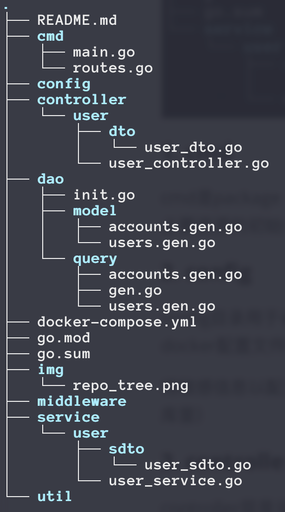

## api.backend.xjco2013

SE项目后端仓库

### 项目结构



#### 1. cmd

cmd是package main所在的目录，也是项目的启动目录。包含main函数，路由的初始化，以及一些项目启动时的必要资源的初始化

#### 2. config

config目录用于存放各类配置文件，如数据库配置文件(包含数据库账号密码等等)，环境变量，JWT加密密钥，docker配置文件等等。

将敏感信息以配置的形式存放，而不是直接写在代码里，提高安全性。（所以这个目录下的文件有一些不会推到仓库里）

#### 3. middleware

middleware负责存放我们编写的中间件，主要是为了在请求到达时做一些鉴权，限流，补充上下文等操作。

#### 4. controller

再经过中间件之后，请求就来到了controller层，controller层负责接收请求对象后做一些业务逻辑校验，比如有没有缺少必要的请求参数。之后会调用service层的服务。controller层一般不写业务逻辑，只针对请求参数的校验，和对业务数据的包装。

**dto**

dto全称是 data transfer object，用来把请求中的参数包装成结构体，方便管理和传递。

比如请求传入下面这个body

```json
{
    "id": 1,
    "name": "xiaofei",
    "age": "20"
}
```

那么我们在代码中就可以定义一个dto，负责对这个请求的包装：

```go
// 一般命名规范为 xxxReq
type UserReq struct {
    ID int `json:"id"`
    Name string `json:"name"`
    Age string `json:"age"`
}
```


#### 5. Service

service层是我们项目中最重型的一层，是业务逻辑的主要体现，所有的业务逻辑大部分都会写在service层中。

service层接受controller层给它包装好的业务数据，然后进行业务逻辑的处理，最后把业务数据包装成数据库模型传入给dao层

**sdto**

sdto == service data transfer object，顾名思义和dto一样，也是对数据的包装。

只不过dto是 http请求 --> controller，而sdto是 controller --> service


#### 6. Dao

dao == data access object，这一层封装了对数据库的操作，在我们项目中这一层我是用框架自带的脚手架生成的，很方便


#### 7. util

这个目录主要用来放一些全局的工具函数


### 各层之间交互关系如图

